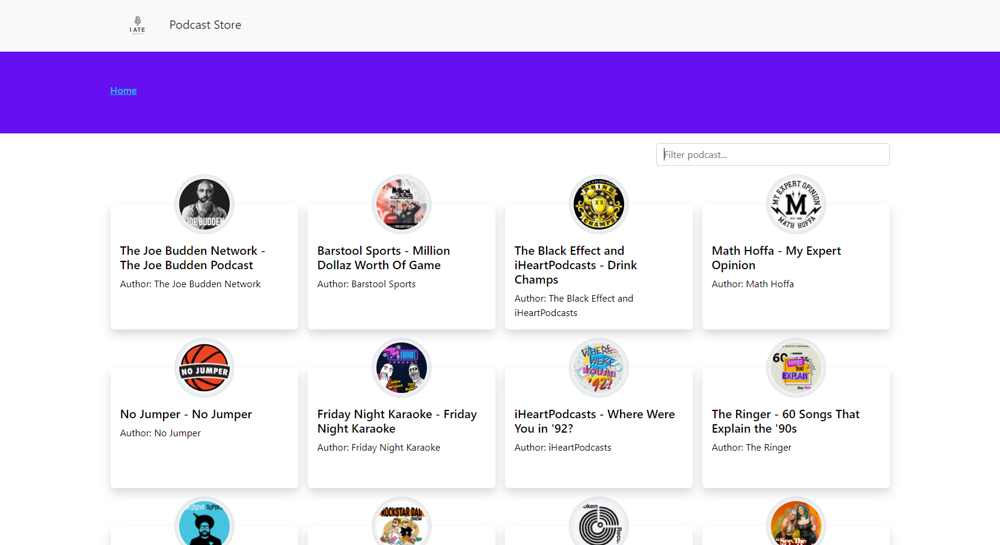
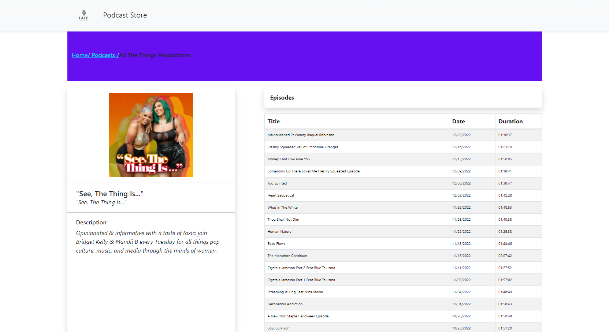
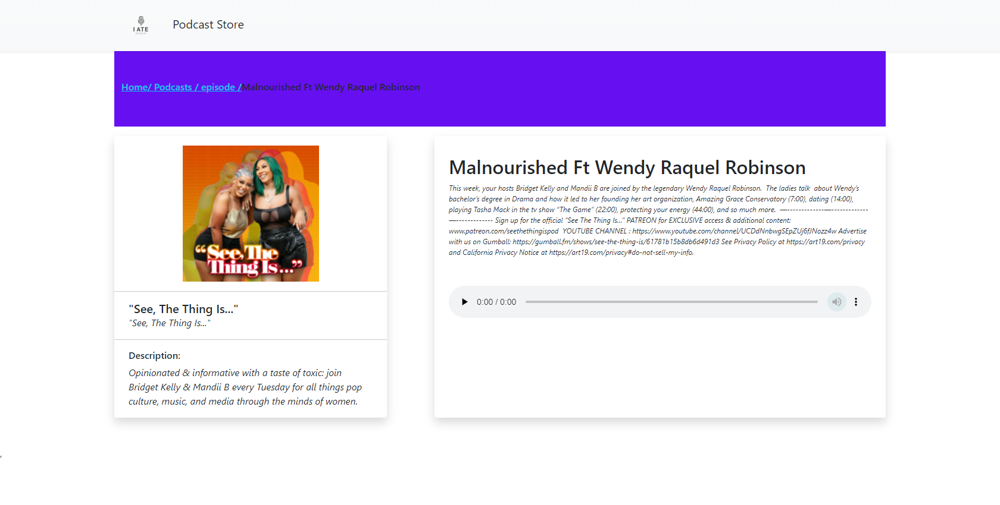
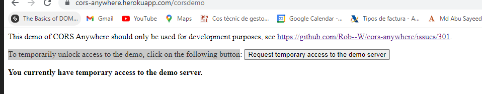

### <h2 style="text-align:center">React-Podcast-App</h2>

Podcast streaming site , podcast listing and single podcast detail page, listening the podcast which should be on an podcast site.

  
- - -

### About the project

An podcast site with basic view.You can view all the available podcast go to the detail page of the relevant podcast, you can listen the podcast you like from your favorite artist list.

The project was developed in conjunction with React.js, including Context, Hooks, and Life Cycles Methods. Styled with styled components and bootstrap.

### Built With

- React.js
- Bootstrap
- Axios
- External API
- moment.js
- styled components

### Getting started

---

- fork the project and clone it locally.
- In the project directory, you can follow the steps below to download the dependencies:

  `npm install `

- In the project directory, you can run:

  `npm run`

### Usage

To view single podcast here what you need to do

Visit the following link https://cors-anywhere.herokuapp.com/corsdemo
and then to temporarily unlock access to the demo, click on the following button you will se on the site so that you can see all the details and listen your favorite podcast.

---

You can list the podcast by their title, artist additionally you can clear filter just with backspaces.You can listen your favorite podcast from my site.

### Roadmap

---

- [x] Fetching podcast data, search podcast, single podcast.
- [x] Responsive Design.
- [x] single episode.
- [ ] Complete the sign in and sign up process.
- [ ] Add to favorites and favorites page.
